# 🚀 Enterprise AI BRD Generator & Estimation Platform
# Complete Project Description, Functionalities, Architecture, Dataflow & System Manual

---

## 📑 Table of Contents
1. [Executive Overview & Vision](#1-executive-overview--vision)
2. [Core Business Problem & Value Proposition](#2-core-business-problem--value-proposition)
3. [Comprehensive Functional Capabilities](#3-comprehensive-functional-capabilities)
4. [Multi-Persona Collaborative Architecture](#4-multi-persona-collaborative-architecture)
5. [System Architecture & Component Decomposition](#5-system-architecture--component-decomposition)
6. [End-to-End Dataflow & Lifecycle Progression](#6-end-to-end-dataflow--lifecycle-progression)
7. [Mathematical Estimation & Financial Modeling](#7-mathematical-estimation--financial-modeling)
8. [Universal AI Disciplines & Multi-Cloud Coverage](#8-universal-ai-disciplines--multi-cloud-coverage)
9. [6-Pack Deliverable Export Specifications](#9-6-pack-deliverable-export-specifications)
10. [REST API Specification](#10-rest-api-specification)
11. [Execution Runbook & Operational Guide](#11-execution-runbook--operational-guide)

---

## 1. Executive Overview & Vision

The **Enterprise AI Business Requirements Document (BRD) Generator & Estimator Platform** is an intelligent, multi-persona pair-programming and pre-sales engineering acceleration engine.

It automates and compresses the end-to-end lifecycle of enterprise software and AI project scoping—transforming what typically takes **3 to 4 weeks of cross-functional meetings, manual spreadsheet estimations, and deck drafting into a streamlined, 15-minute collaborative session**.

### Primary Target Applications:
1. **AI & Modernization Initiatives:**
   - Generative AI & Large/Small Language Models (RAG, Fine-Tuning, Multi-Agent Orchestration).
   - Natural Language Processing & Contract Intelligence (Extraction, Risk Classification).
   - Computer Vision (Defect Detection, OCR, Object Tracking).
   - Deep Learning & Speech (Call Center Audio Analytics, Speech-to-Text).
   - Classical Machine Learning (Predictive Tabular Models, Fraud Anomaly Detection, Forecasting).
2. **Conventional Enterprise Software:**
   - Core ERP/HRMS workflows (e.g., Enterprise Leave Management Systems - ELMS).
   - Business automation, operational dashboards, and transaction processing portals.

---

## 2. Core Business Problem & Value Proposition

### The Problem in Traditional Enterprise Scoping:
- **Prolonged Scoping Cycles:** Pre-sales engineers, delivery managers, and architects spend 20+ business days in discovery interviews.
- **Ambiguous Requirements & Scope Creep:** High-level problem statements are poorly specified, leading to misaligned technical assumptions.
- **Double Counting & Defective Estimation:** Spreadsheet-based models often double-count Project Management (PM) overhead or use arbitrary multiplier heuristics.
- **Siloed Stakeholders:** Business leads, solution architects, and project managers operate across disconnected tools (Word docs, Excel sheets, email threads).
- **Infeasible Schedules:** Estimates rarely account for statutory holidays, realistic resource ramp rates, and FTE bottlenecks.

### The Platform's Solution:
```
┌─────────────────────────────────────────────────────────────────────────────┐
│                          BEFORE (Traditional Scoping)                       │
│  Client Meeting ──► Manual Notes ──► Spreadsheets ──► 3 Weeks ──► Draft BRD │
│  (High error rate, uncoordinated roles, double-counted PM overhead)        │
└─────────────────────────────────────────────────────────────────────────────┘
                                      ▼
┌─────────────────────────────────────────────────────────────────────────────┐
│                           AFTER (This Platform)                             │
│  Client Lead (:8081) ─┐                                                     │
│  Architect   (:8082) ─┼──► Synchronized Real-Time Backend ──► 15 Minutes    │
│  Delivery PM (:8083) ─┘        (32-Domain Gate + 18-Phase WBS Engine)       │
│                                           ▼                                 │
│          Instant 6-Pack Deliverable Export (.docx, .pdf, .xlsx, .pptx)      │
└─────────────────────────────────────────────────────────────────────────────┘
```

---

## 3. Comprehensive Functional Capabilities

### 3.1 Adaptive Single-Question Discovery Cadence
- **Progressive Disclosure:** Rather than presenting an overwhelming 50-field form, the system conducts an intelligent conversational interview, asking **one focused question at a time**.
- **Disambiguation Engine:** When users submit vague or open-ended requirements (e.g., *"We want an AI chatbot"*), the system flags ambiguity, presents tailored architectural blueprints (HITL options), and disambiguates the scope before progressing.
- **Multi-Field Extraction:** Intelligently extracts multiple parameters from natural language inputs (e.g., *"We want an Azure MVP running for 8 weeks in India with 500 users"* automatically populates Cloud, Tier, Duration, Geography, and Scale).

### 3.2 32-Domain Enterprise Architecture & Gating Engine
Every enterprise initiative is evaluated against 32 strict architectural, operational, and governance domains:
```
  [1] Client & Initiative       [9] Integrations Count        [17] Security & CMEK
  [2] Business Problem & ROI    [10] Data Sources Count       [18] Deployment Geography
  [3] Delivery Tier (PoC/Prod)  [11] Delivery Channels        [19] On-Premises Footprint
  [4] Duration (Weeks)          [12] Language Support         [20] Cloud Subscriptions
  [5] Target Start Date         [13] Deployment Environments  [21] HA SLA & DR Policy
  [6] Standby / Shadow Rate     [14] Architecture Components  [22] Core Business Logic
  [7] Distinct Capabilities     [15] Technical Complexity     [23] Grounding / Privacy
  [8] User Personas Count       [16] Regulatory & Compliance  [24] Total Named Users
  ... and up to 32 comprehensive operational & infrastructure domains.
```
- **95% Confidence Gate:** Prevents BRD synthesis until $\ge 95\%$ of domains are confirmed or resolved via architectural delegation.

### 3.3 Technical Escalation & Delegation Subsystem
- Business users often lack technical details regarding cloud infrastructure, vector databases, or high-availability failover.
- The **"Escalate to Architect"** feature allows business leads to delegate specific technical questions directly to the Principal Solutions Architect's queue.
- The Architect is presented with an Executive Briefing detailing the business context, impact, and pre-formulated options for 1-click resolution.

### 3.4 Dual-Review & Tripartite Governance Sign-Off
- **Dual-Review Gate (Stage 3):** Requires explicit cryptographic or named approvals from both the **Client Business Lead** and the **Solutions Architect**.
- **Tripartite PM Review Gate (Stage 4):** Engages the **Senior Delivery PM** to audit the 18-phase timeline, 12-discipline resource loading, statutory holiday impacts, and budget caps ($30/hr blended baseline) before release.

### 3.5 18-Phase Work Breakdown Structure (WBS) Engine
Sizes 42 to 98 individual development and governance activities across 18 delivery phases:
- **P01:** Project Initiation & Governance
- **P02:** Architecture & Cloud Environment Setup
- **P03:** Data Discovery, Pipeline & Storage Engineering
- **P04:** Core Engine / Model Ingestion & RAG Indexing
- **P05:** Business Logic & Rules Processing
- **P06:** API Gateway & Microservices Backend
- **P07:** Enterprise User Interface & Dashboards
- **P08:** Role-Based Access Control & CMEK Security
- **P09:** Integration Engineering (SSO, ERP, CRM)
- **P10:** Verification, Synthetic Testing & Eval Harness
- **P11:** User Acceptance Testing (UAT) & Remediation
- **P12:** Non-Functional Performance & Load Testing
- **P13:** Disaster Recovery, HA & Failover Verification
- **P14:** Statutory Compliance & Data Privacy Audit
- **P15:** Knowledge Transfer & Admin Enablement
- **P16:** Production Deployment & CI/CD Pipeline
- **P17:** Hypercare & Warranty Support
- **P18:** Continuous Delivery Management (Explicitly modeled with **zero double-counting**)

### 3.6 Day-Wise Schedule & Statutory Holiday Engine
- Models actual business working calendars across geographies (**India, US, UK, EU**).
- Embeds official national holidays (e.g., India 2026: Republic Day, Independence Day, Gandhi Jayanti, Diwali).
- Enforces peak FTE limits (e.g., maximum 2.0 FTE per role) and team ramp rate caps (maximum 3 new team members per week).
- Validates schedule feasibility (`PASS` / `FAIL`), ensuring zero schedule stretch beyond agreed delivery commitments.

### 3.7 Assumption Quality Gate & QA Audit
- Audits all project assumptions (`A-001` through `A-012`).
- Identifies open risks or pending items (flagged as `Under Review`).
- Executes 22 internal sanity checks for orphaned tasks, negative effort values, or formula discrepancies.

---

## 4. Multi-Persona Collaborative Architecture

The system features an enterprise multi-port architecture where 4 distinct roles operate simultaneously with synchronized state:

```
┌─────────────────────────────────────────────────────────────────────────────────────────┐
│                           SYNCHRONIZED MULTI-PORT TOPOLOGY                              │
├─────────────────────────────────────────────────────────────────────────────────────────┤
│                                                                                         │
│   PORT :8081 ───► CLIENT BUSINESS LEAD PORTAL                                           │
│                   • Natural language project ideation & discovery interview             │
│                   • Free-text problem statement definition                              │
│                   • "Escalate to Architect" technical delegation                        │
│                   • Client dual-review approval / revision requests                     │
│                                                                                         │
│   PORT :8082 ───► PRINCIPAL SOLUTIONS ARCHITECT PORTAL                                  │
│                   • Technical escalation briefing & 1-click resolution                  │
│                   • Cloud architecture component mapping (C001-C006)                    │
│                   • Infrastructure Bill of Materials (BoM) cost calculation             │
│                   • Technical dual-review sign-off                                      │
│                                                                                         │
│   PORT :8083 ───► SENIOR DELIVERY PROJECT MANAGER PORTAL                                │
│                   • 18-phase WBS breakdown & 12-discipline role allocation              │
│                   • Day-wise schedule calendar & statutory holiday impact analysis      │
│                   • Tripartite discussion thread (Client + SA + PM)                     │
│                   • Final consensus sign-off & release authorization                    │
│                                                                                         │
│   PORT :8084 ───► ENTERPRISE SYSTEM ADMINISTRATOR CONSOLE                               │
│                   • Regional working calendar & holiday schedules                       │
│                   • Master role rate cards ($/hr) & delivery tier weights               │
│                   • LLM model provider endpoints & governance policies                  │
│                                                                                         │
└─────────────────────────────────────────────────────────────────────────────────────────┘
```

---

## 5. System Architecture & Component Decomposition

### 5.1 Architecture Diagram
```mermaid
graph TD
    subgraph Frontend Portals
        C[Port 8081: Client Portal]
        A[Port 8082: Architect Portal]
        P[Port 8083: PM Portal]
        AD[Port 8084: Admin Console]
    end

    subgraph FastAPI Core Gateway (app.py)
        Auth[Auth & Multi-Port Router]
        SessionMgr[Session State Manager]
        WorkflowMgr[Workflow State Engine]
    end

    subgraph Intelligent Backend Engines
        Disc[agent_discovery.py<br/>Discovery & Extraction]
        Plan[agent_planner.py<br/>WBS, Architecture & BoM]
        JSONEng[json_questionnaire_engine.py<br/>Template Engine]
        LLM[llm_gateway.py<br/>Multi-Provider LLM Gateway]
        Impact[impact_engine.py<br/>Change Impact Engine]
    end

    subgraph Export Generation (export_generator.py)
        Docx[Word BRD .docx]
        PDF[Executive PDF .pdf]
        Xlsx[Financial Model .xlsx]
        Pptx[Deck .pptx]
        Jira[Jira CSV .csv]
        JSONExp[Schema JSON .json]
    end

    C --> Auth
    A --> Auth
    P --> Auth
    AD --> Auth

    Auth --> SessionMgr
    SessionMgr --> WorkflowMgr

    WorkflowMgr --> Disc
    WorkflowMgr --> Plan
    Disc --> JSONEng
    Plan --> LLM
    WorkflowMgr --> Impact

    Plan --> ExportGeneration
    subgraph ExportGeneration
        Docx
        PDF
        Xlsx
        Pptx
        Jira
        JSONExp
    end
```

### 5.2 Key Codebase Modules & Responsibilities

| Path | Purpose |
|---|---|
| [`app.py`](file:///d:/Projects/Jobs/BRD/app.py) | Central FastAPI application hosting REST endpoints, session state caching, multi-port routing, and real-time messaging. |
| [`run_multi_port.py`](file:///d:/Projects/Jobs/BRD/run_multi_port.py) | Multi-threading server launcher running ports 8081, 8082, 8083, and 8084 concurrently with unified memory state. |
| [`backend/agent_discovery.py`](file:///d:/Projects/Jobs/BRD/backend/agent_discovery.py) | Interactive discovery conversation engine, regex entity extraction, 32-domain completeness calculation, and question sequencing. |
| [`backend/agent_planner.py`](file:///d:/Projects/Jobs/BRD/backend/agent_planner.py) | Universal AI domain classifier, 18-phase WBS sizing model, Cloud BoM calculation, statutory holiday engine, and schedule feasibility. |
| [`backend/export_generator.py`](file:///d:/Projects/Jobs/BRD/backend/export_generator.py) | Generates production-grade `.docx`, `.pdf`, `.xlsx`, `.pptx`, `.csv`, and schema-compliant `.json` deliverables. |
| [`backend/json_questionnaire_engine.py`](file:///d:/Projects/Jobs/BRD/backend/json_questionnaire_engine.py) | Parses and validates against `ai_brd_questionnaire_template.json` to guarantee strict JSON schema compliance. |
| [`backend/llm_gateway.py`](file:///d:/Projects/Jobs/BRD/backend/llm_gateway.py) | Multi-provider abstraction layer supporting Azure OpenAI, AWS Bedrock, Google Gemini, Anthropic, and local models. |
| [`backend/models.py`](file:///d:/Projects/Jobs/BRD/backend/models.py) | Pydantic data schemas representing `ProjectSession`, `BRDDocument`, `TaskItem`, `WorkflowState`, and `CloudBoMItem`. |
| [`backend/impact_engine.py`](file:///d:/Projects/Jobs/BRD/backend/impact_engine.py) | Calculates downstream schedule, effort, and cost deltas when stakeholders modify requirements post-generation. |
| [`static/index.html`](file:///d:/Projects/Jobs/BRD/static/index.html) | Modern, responsive single-page application (SPA) with role switcher, chat interface, live BRD preview, and export center. |
| [`static/login.html`](file:///d:/Projects/Jobs/BRD/static/login.html) | Enterprise role-based authentication portal routing users to their dedicated persona port. |

---

## 6. End-to-End Dataflow & Lifecycle Progression

### 6.1 State Machine Lifecycle
### 6.1 6-Stage Lifecycle State Machine

```mermaid
stateDiagram-v2
    [*] --> STAGE_1_IDEATION
    STAGE_1_IDEATION --> STAGE_2_DISCOVERY: Project Title, Tier & Cloud Aligned
    
    state STAGE_2_DISCOVERY {
        [*] --> SingleQuestion
        SingleQuestion --> MultiFieldExtraction: User Response
        MultiFieldExtraction --> EscalationCheck
        EscalationCheck --> TechnicalEscalation: Cloud/Infra Question
        TechnicalEscalation --> ArchitectResolution: Port 8082 Resolves
        ArchitectResolution --> DomainScoring
        EscalationCheck --> DomainScoring: Business Answer
        DomainScoring --> SingleQuestion: Confidence < 95%
        DomainScoring --> GatingPassed: Confidence >= 95%
    }
    
    STAGE_2_DISCOVERY --> STAGE_3_DUAL_REVIEW: Draft BRD Synthesized (95% Gate Passed)
    
    state STAGE_3_DUAL_REVIEW {
        [*] --> ClientReview: Port 8081
        [*] --> ArchitectReview: Port 8082
        ClientReview --> ChangeRequested: Revision Notes
        ArchitectReview --> ChangeRequested: Technical Tuning
        ChangeRequested --> ReplanBRD: Regenerate
        ReplanBRD --> ClientReview
        ClientReview --> ClientApproved: Sign-Off
        ArchitectReview --> ArchitectApproved: Sign-Off
        ClientApproved --> BothApproved
        ArchitectApproved --> BothApproved
    }
    
    STAGE_3_DUAL_REVIEW --> STAGE_4_ESTIMATES: Both Client & Architect Signed Off
    
    state STAGE_4_ESTIMATES {
        [*] --> WBS18Phases: 18-Phase Roadmap Sizing
        WBS18Phases --> DayWisePlan: Calendar & Statutory Holidays
        DayWisePlan --> Disciplines12: 12 Delivery Disciplines Loading
    }
    
    STAGE_4_ESTIMATES --> STAGE_5_PM_CONSENSUS: Estimates Locked for PM Review
    
    state STAGE_5_PM_CONSENSUS {
        [*] --> AuditWBS: Review 18 Phases & 12 Disciplines
        AuditWBS --> HolidayCheck: Reconcile Statutory Calendar
        HolidayCheck --> RateAudit: Verify $30/hr Rate & Cloud Budget
        RateAudit --> PMAccepted: Final Governance Attestation
    }
    
    STAGE_5_PM_CONSENSUS --> STAGE_6_EXPORT_DISTRIBUTION: Delivery PM Certifies Deliverables
    STAGE_6_EXPORT_DISTRIBUTION --> [*]: 6-Pack Synthesized (.docx, .pdf, .xlsx, .pptx, .csv, .json)
```


### 6.2 Step-by-Step Data Progression
1. **Session Initialization (`/api/session`):** A unique UUID is generated; default questions and 32-domain tracking tables are bound to the session.
2. **Conversational Ingestion (`/api/chat`):** The user provides input via chat. `extract_and_fill_domains_from_text()` scans for keywords (e.g., "Azure", "PoC", "India", "4 weeks") and updates `session.answers`.
3. **Escalation Handling (`/api/workflow/delegate-architect`):** Unanswered technical questions create an item in `session.workflow.escalated_topics`. The Architect reviews and resolves this on `:8082`.
4. **WBS & BoM Synthesis (`generate_brd`):** When confidence hits 95%, `agent_planner.py` executes:
   - Microservice decomposition (6 components).
   - Monthly Cloud BoM calculation.
   - 18-Phase WBS sizing across 12 disciplines.
   - Day-wise schedule modeling against statutory holidays.
5. **Dual Review (`/api/workflow/dual-review/approve`):** Client Lead and Solutions Architect submit feedback or approval signatures.
6. **PM Governance Review (`/api/workflow/pm-review/approve`):** Delivery PM verifies labor costs, duration stretch, and releases the final deliverable pack.
7. **Deliverable Generation (`/api/export/*`):** Output files are written to `exports/` and served directly for download.

---

## 7. Mathematical Estimation & Financial Modeling

### 7.1 WBS Task Effort Sizing Formula
Every task $i$ in the 18-phase library is sized using explicit multiplicative parameters:
$$\text{Effort}_i (\text{Person-Days}) = \text{BaseEffort}_i \times M_{\text{tier}} \times M_{\text{complexity}} \times M_{\text{compliance}} \times S_{\text{scale}}$$

Where:
- **$M_{\text{tier}}$ (Delivery Tier Multiplier):**
  - $\text{PoC} = 0.50\times$
  - $\text{MVP} = 0.75\times$
  - $\text{Production Grade} = 1.00\times$
  - $\text{Enterprise Multi-Region} = 1.50\times$
- **$M_{\text{complexity}}$ (Technical Complexity Multiplier):**
  - $\text{Low} = 0.85\times$
  - $\text{Medium} = 1.00\times$
  - $\text{High} = 1.30\times$
  - $\text{Very High} = 1.65\times$
- **$M_{\text{compliance}}$ (Statutory Compliance Multiplier):**
  - $\text{Internal Policy Only} = 1.00\times$
  - $\text{SOC2 / ISO27001} = 1.15\times$
  - $\text{HIPAA / PCI-DSS} = 1.30\times$
  - $\text{Gov / Banking / FedRAMP} = 1.50\times$
- **$S_{\text{scale}}$ (System Scale Factor):**
  - Calculated based on data sources, integrations, named users, and concurrency.

### 7.2 Financial Labor Cost Calculation
Labor costs are calculated across the 12 disciplines using the master enterprise blended rate card:
$$\text{Total Labor Cost} = \sum_{r=1}^{12} \left( \text{Person-Days}_r \times \text{HoursPerDay} \times \text{HourlyRate}_r \right)$$
- **Standard Working Day:** 8.0 hours/day (9.0 hours in India).
- **Enterprise Baseline Rate:** $30.00 / hour ($240.00 / person-day).

### 7.3 Infrastructure Bill of Materials (BoM) Calculation
Monthly infrastructure costs encompass compute, storage, search indexing, and managed API consumption:
$$\text{Monthly BoM} = C_{\text{compute}} + C_{\text{database}} + C_{\text{vector\_search}} + C_{\text{object\_storage}} + C_{\text{llm\_tokens}} + C_{\text{monitoring}}$$

---

## 8. Universal AI Disciplines & Multi-Cloud Coverage

The platform provides native component mapping and Sizing BoMs across **5 AI Disciplines** and **5 Cloud Hyperscalers**:

| AI Discipline | Sub-Domains Supported | Representative Services |
|---|---|---|
| **Generative AI & LLMs** | Enterprise RAG, Agentic Workflows, Policy Q&A | Azure OpenAI, Bedrock, Vertex AI, Milvus, LangGraph |
| **Natural Language Processing** | Contract Intelligence, Sentiment, Multilingual NER | DeBERTa, LayoutLM, Azure Document Intelligence, Textract |
| **Computer Vision** | Surface Defect Detection, OCR, YOLO Object Tracking | Triton Server, TensorRT, Roboflow, AWS Rekognition |
| **Deep Learning & Speech** | Call Center Audio Analytics, Speech-to-Text | Whisper, Kaldi, Google Speech-to-Text, Azure Speech |
| **Classical Machine Learning** | Tabular Churn, Time-Series Forecasting, Fraud Detection | XGBoost, LightGBM, AWS SageMaker, Vertex AI Tabular |

### Multi-Cloud Hyperscaler Service Matrix:
- **Microsoft Azure:** Azure App Service, Azure Functions, Azure AI Search, Azure OpenAI, Cosmos DB / PostgreSQL, Azure Blob Storage.
- **Amazon Web Services (AWS):** AWS Lambda, ECS Fargate, Amazon Bedrock, OpenSearch Serverless, DynamoDB / Aurora, S3.
- **Google Cloud Platform (GCP):** Cloud Run, Vertex AI Search, Gemini 2.5 Pro, Cloud Spanner / Firestore, Cloud Storage.
- **IBM Cloud:** Code Engine, Watson Discovery, watsonx.ai, Cloud Object Storage, IBM Db2 on Cloud.
- **Hybrid / On-Premises:** Local Kubernetes (k8s), Triton Inference Server, MinIO Object Storage, Qdrant / Milvus Local, PostgreSQL.

---

## 9. 6-Pack Deliverable Export Specifications

Every session produces 6 enterprise-grade artifacts saved directly into [`exports/`](file:///d:/Projects/Jobs/BRD/exports):

1. **Enterprise Business Requirements Document (`.docx`):**
   - 20+ comprehensive sections: Executive Summary, Business Problem, Scope In/Out, 25 Functional Requirements, 15 Business Rules, 12 Gated Assumptions, Security & NFRs, 18-Phase WBS, and RACI Matrix.
2. **Executive Summary PDF (`.pdf`):**
   - High-impact, beautifully formatted executive briefing with sign-off signature blocks for C-level presentation.
3. **Financial Estimation Model (`.xlsx`):**
   - 4 fully linked sheets: *Executive Summary*, *18-Phase WBS Effort Ledger*, *12-Discipline Role Breakdown*, and *Monthly Cloud Infrastructure BoM*.
4. **Project Kickoff Presentation Deck (`.pptx`):**
   - 10-slide executive deck including Agenda, Problem Statement, Architectural Blueprint, Sizing Overview, Milestones, and Sign-Off Gates.
5. **Jira Agile Backlog (`.csv`):**
   - Directly importable into Atlassian Jira, containing Epics, User Stories, Story Point estimates, and Acceptance Criteria.
6. **Structured Machine-Readable JSON (`.json`):**
   - Complete machine-readable representation conforming strictly to [`ai_brd_questionnaire_template.json`](file:///d:/Projects/Jobs/BRD/ai_brd_questionnaire_template.json).

---

## 10. REST API Specification

| Method | Endpoint | Description |
|---|---|---|
| `GET` | `/api/session` | Retrieves or initializes a project session and returns confidence score, current question, and BRD state. |
| `POST` | `/api/chat` | Submits an answer to the current discovery question and triggers NLP extraction and confidence recalculation. |
| `GET` | `/api/auth/roles` | Returns available persona roles and their assigned localhost ports. |
| `POST` | `/api/auth/login` | Dynamic authentication endpoint returning user credentials, badge, and target port. |
| `POST` | `/api/workflow/ideate` | Submits initial project ideation parameters from Client Lead and Solutions Architect. |
| `POST` | `/api/workflow/delegate-architect` | Delegates an ambiguous or complex technical question to the Architect queue. |
| `GET` | `/api/workflow/architect/briefing` | Fetches technical escalation briefing items with pre-formulated options. |
| `POST` | `/api/workflow/architect/resolve` | Resolves an escalated technical item with chosen recommendations. |
| `POST` | `/api/workflow/dual-review/approve` | Submits formal sign-off approval from Client or Solutions Architect. |
| `POST` | `/api/workflow/dual-review/feedback` | Requests modifications and triggers real-time BRD recalculation. |
| `POST` | `/api/workflow/pm-review/replan` | Applies PM governance parameter adjustments (contingency, staffing limits). |
| `POST` | `/api/workflow/pm-review/approve` | Submits final PM governance sign-off and releases deliverables. |
| `GET` | `/api/export/docx` | Generates and downloads the Word BRD document. |
| `GET` | `/api/export/pdf` | Generates and downloads the Executive PDF report. |
| `GET` | `/api/export/excel` | Generates and downloads the multi-tab Financial Estimation Model workbook. |
| `GET` | `/api/export-pptx` | Generates and downloads the 10-slide PowerPoint presentation deck. |
| `GET` | `/api/export/jira` | Generates and downloads the Jira Backlog CSV file. |
| `GET` | `/api/export/json` | Generates and downloads the standardized Schema JSON specification. |

---

## 11. Execution Runbook & Operational Guide

### 11.1 Prerequisites
- Python 3.11 or Python 3.12.
- Core dependencies: `fastapi`, `uvicorn`, `pydantic`, `python-docx`, `python-pptx`, `openpyxl`, `reportlab`, `requests`, `httpx`.

### 11.2 Starting the Local Multi-Port Servers
To launch all 4 synchronized persona portals:
```powershell
python run_multi_port.py
```
This boots:
- **Client Lead Portal:** [http://127.0.0.1:8081](http://127.0.0.1:8081)
- **Principal Solutions Architect Portal:** [http://127.0.0.1:8082](http://127.0.0.1:8082)
- **Senior Delivery PM Portal:** [http://127.0.0.1:8083](http://127.0.0.1:8083)
- **Enterprise System Administrator Console:** [http://127.0.0.1:8084](http://127.0.0.1:8084)

### 11.3 Running the Automated End-to-End Use Case
To execute the automated discovery workflow, BRD generation, and deliverable export programmatically:
```powershell
python run_usecase_workflow.py
```

### 11.4 Running Validation Test Suites
To verify test suites and benchmark reconciliation:
```powershell
python tests/test_multi_persona_workflow.py
python tests/test_universal_ai_brd_generator.py
python tests/test_elms_benchmark_project.py
```

---
*Enterprise AI BRD Generator Platform — Engineering Architecture & Operations Manual.*
