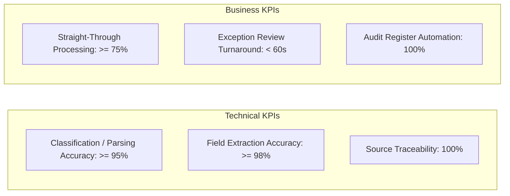
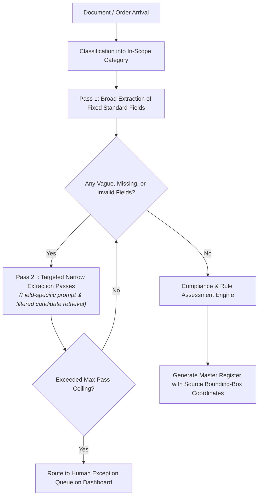
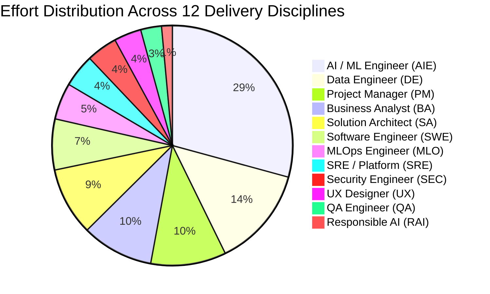

# 📑 Enterprise AI Business Requirements Document & Sizing Specification
## Project: Automated Multi-Channel Order Ingestion & ERP Integration Platform
### Client: Havi Logistics | Delivery Tier: Proof of Concept (PoC) | Hosting: India (Azure Central)

---

## 1. Executive Summary & Engagement Profile

| Attribute | Specification |
| :--- | :--- |
| **Client / Account** | **Havi Logistics** |
| **Engagement Name** | Automated Multi-Channel Order Ingestion & ERP Integration Platform |
| **Solution Domain** | Artificial Intelligence / Generative AI & Automation |
| **Primary Cloud Platform** | Microsoft Azure (India (Azure Central)) |
| **Delivery Tier** | **Proof of Concept (PoC)** (Phase Factor Weight: `0.289x`) |
| **Reference Duration** | **6.0 Weeks** (30 Working Days) |
| **Total Estimated Effort** | **127.1 Person-Days** (1,143.9 Person-Hours @ 9 hrs/day) |
| **Resolved Duration Stretch**| **0.0 Weeks** (Feasibility Verified) |
| **Peak Team Allocation** | **5.13 FTEs** |
| **Estimated Monthly OPEX** | **~$1,480 / month** on Microsoft Azure |

---

## 2. Business Problem Statement & Objectives

### 2.1 Current-State Challenges (As-Is)
Havi Logistics handles large-scale import and export operations. Orders arrive continuously via email PDF invoices, telephonic customer calls, and an internal web portal. Operations personnel manually extract line items, verify inventory availability, and re-key orders into an on-premises legacy ERP (AS400), creating 18-minute processing lags per order and error risks during morning rush hours.

- **Manual Bottlenecks**: Heavy reliance on operational and technical subject matter experts, creating multi-day turnarounds.
- **Inconsistent Standard Enforcement**: Varied layouts, formats, and non-standard inputs lead to missed deviations.
- **Fragmented Visibility**: Status, exception logs, and approval records reside in disconnected spreadsheets without clause-level auditability.

### 2.2 Project Objectives (To-Be)
Deploy a modern, secure, cloud-native automated ingestion, extraction, and validation pipeline on Microsoft Azure that delivers end-to-end straight-through processing with strict human-in-the-loop oversight.

### 2.3 Quantified Success Metrics

---

## 3. Scope Definition

### 3.1 In-Scope (Phase 1: Proof of Concept (PoC))
- **Representative Data Corpus**: Ingestion and validation of sample documents and operational records.
- **Ontology & Rules Configuration**: Categorization frameworks and principle rule sets defined for in-scope domains.
- **AI Extraction & Processing Engine**: Layout-aware parsing, hybrid vector/keyword retrieval, and multi-pass AI extraction.
- **Human-in-the-Loop Review**: Exception handling interface for items scoring below confidence thresholds.
- **Traceable Risk & Audit Register**: Master data export conforming to Havi Logistics's operational reporting formats.
- **Read-Only Dashboard**: Integrated with corporate Single Sign-On (Entra ID / OAuth2).

### 3.2 Explicitly Out-of-Scope (Deferred to Future Production Phases)
- **Direct Real-Time ERP System Writeback**: Phase 1 delivers automated structured exports; legacy DB writeback is scheduled for Phase 2.
- **Unstructured Scanned Fax OCR Tuning**: Phase 1 targets digital-native formats; noisy image pre-processing is deferred.
- **Multi-Region Disaster Recovery**: Single-instance high-resilience architecture without secondary active/active failover.
- **Autonomous Unsupervised Execution**: AI acts strictly as an assistant; all final commercial actions require human sign-off.

---

## 4. System Architecture & Technical Component Decomposition

The solution comprises **6 primary architecture components** deployed within Havi Logistics's Microsoft Azure environment:

```mermaid
graph TB
    subgraph "Ingestion & Landing Layer"
        C001["<b>C001: Landing Store & Ingestion Pipeline</b><br/>Microsoft Azure Blob Storage + Document Intelligence"]
    end

    subgraph "Retrieval & Knowledge Layer"
        C002["<b>C002: Vector & Search Index</b><br/>Microsoft Azure AI Search (Hybrid Keyword + Vector)"]
        C004["<b>C004: Master State & Audit Store</b><br/>Managed Relational DB (SQL / PostgreSQL)"]
    end

    subgraph "Core AI Reasoning Engine"
        C003["<b>C003: AI Processing & Orchestration Engine</b><br/>Microsoft Azure OpenAI Service (GPT-4o) + Microservices"]
    end

    subgraph "Presentation & Governance"
        C005["<b>C005: Operational Dashboard & Evals</b><br/>App Service Dashboard + Golden Set Evaluation"]
        C006["<b>C006: Identity, Secrets & Landing Zone</b><br/>Entra ID (SSO) + Azure Key Vault"]
    end

    C001 -->|Extracted Chunks & Embeddings| C002
    C001 -->|Document Records| C004
    C002 <-->|Hybrid Retrieval| C003
    C003 -->|Structured Findings & Provenance| C004
    C004 -->|Aggregated Data| C005
    C006 -.->|Managed Identities & RBAC| C001
    C006 -.->|API Keys & Secrets| C003
    C006 -.->|Single Sign-On| C005
```

### Component Breakdown Table

| CID | Component Name | Technology Choice | Key Responsibilities |
| :--- | :--- | :--- | :--- |
| **C001** | Landing Store & Ingestion Pipeline | Microsoft Azure Storage, Document Intelligence | Secure landing container for incoming batches; layout-aware parsing with exact coordinate mapping for 100% auditability. |
| **C002** | Vector & Clause Index Layer | Microsoft Azure AI Search | High-performance index storing 1,536-dimension embeddings with document and category metadata. |
| **C003** | Core AI Reasoning Engine | Microsoft Azure OpenAI Service (GPT-4o) | Categorization, multi-pass entity extraction, schema enforcement, and rule compliance evaluation. |
| **C004** | Master State & Audit Store | Azure Database (PaaS) | Persists domain ontologies, extraction pass logs, exception queues, and final audit registers. |
| **C005** | Operational Dashboard & Evals | Web App / Python Reporting | Read-only stakeholder visualization, exception resolution queues, and automated RAGAS eval reporting. |
| **C006** | Identity, Secrets & Landing Zone | Entra ID, Azure Key Vault | Enforces Single Sign-On, manages role-based access control (RBAC), and secures credentials across Dev, Test, and UAT. |

---

## 5. Model Execution & Multi-Pass Extraction Strategy

> [!IMPORTANT]
> **Single-Pass Extraction Was Rejected**: A single-pass prompt over complex multi-page operational documents leads to significant hallucination rates on open-textured, ambiguous, or negotiated terms.

The system implements a **Pass-Aware Orchestration Pipeline**:

---

## 6. Sizing Drivers & Scale Baseline

Deterministic sizing parameters calculated for Havi Logistics:

| Category | Sizing Driver Metric | Baseline Value | Calculation / Derivation |
| :--- | :--- | :--- | :--- |
| **Workload** | Requests per Day | **2,000 requests** | Ingestion batches and interactive queries |
| **Workload** | Monthly Model Invocations | **44,000 requests** | 2,000 req/day $	imes$ 22 working days |
| **Workload** | Peak Requests per Second | **3.0 req/sec** | Sizing baseline for compute concurrency |
| **Tokens** | Avg Input Tokens per Request | **3,410 tokens** | 500 prompt + 2,560 retrieved context + 350 system |
| **Tokens** | Avg Output Tokens per Request | **2,000 tokens** | Structured JSON extraction payload |
| **Tokens** | **Monthly Total Azure OpenAI Tokens**| **238,040,000 tokens** | 150M input tokens + 88M output tokens |
| **Throughput**| **Peak Model Throughput (TPM)** | **973,800 tokens/min** | 3.0 req/sec $	imes$ 60 $	imes$ 5,410 tokens/req |
| **Corpus** | Total Target Document Corpus | **50,000 documents** | Enterprise baseline |
| **Vectors** | Searchable Vector Count | **2,000,000 vectors** | 50,000 docs $	imes$ 40 chunks/doc |
| **Storage** | **Searchable Index Footprint** | **23.76 GB** | 1,536-dim vectors + chunk text + 1.6 overhead |
| **Storage** | Total Persistent Data Storage | **32.26 GB** | Relational DB + Blob storage across all envs |
| **Compute** | Application Compute Footprint | **1.0 vCPU / 4.0 GB RAM** | Sized for target peak concurrency |

---

## 7. Work Breakdown Structure (WBS) & Effort Sizing

### 7.1 Mathematical Effort Rollup Formula
$$\text{Total Effort} = \text{Base Delivery (97.5)} + \text{P18 PM Tasks (6.3)} + \text{12\% PM Overhead (11.7)} + \text{10\% Contingency (11.6)} = \mathbf{127.1\text{ Person-Days}}$$

### 7.2 Phase-by-Phase Delivery Ledger (P01 – P18)

| Phase | Phase Name | Base Days | Tier Factor | Applied Days | Key Scope & Deliverables |
| :--- | :--- | :---: | :---: | :---: | :--- |
| **P01** | Mobilisation & Discovery | 13.0 | `1.000` | **11.05** | Kick-off, stakeholder RACI, discovery workshops |
| **P02** | Requirements & Use Cases | 22.0 | `0.400` | **7.48** | Functional specs, persona mapping, MoSCoW |
| **P03** | Data Discovery & Preparation | 27.0 | `0.300` | **6.88** | Data profiling, PII masking strategy, golden dataset |
| **P04** | Solution Architecture | 23.0 | `0.350` | **6.84** | Architecture blueprint, sizing & ADRs |
| **P05** | Landing Zone & Platform Setup | 20.0 | `0.250` | **4.25** | Resource groups, Key Vault, AI quotas |
| **P06** | Data Pipeline & Embedding | 33.0 | `0.400` | **11.22** | Document parsing, chunking & embeddings |
| **P07** | Retrieval & Index Build | 17.0 | `0.500` | **7.24** | Hybrid index, schema & relevance tuning |
| **P08** | Model Orchestration & Prompts | 35.0 | `0.550` | **16.32** | Multi-pass prompts, agent routing, schema validation |
| **P09** | Fine-Tuning & Model Adaptation | 16.0 | `0.200` | **2.72** | Feasibility check & dataset prep |
| **P10** | Application & API Layer | 39.0 | `0.250` | **8.29** | Internal API, business rules, dashboard backend |
| **P11** | Evaluation & Golden Sets | 22.0 | `0.250` | **4.67** | RAGAS benchmark harness, SME review rounds |
| **P12** | Responsible AI & Safety | 31.0 | `0.100` | **2.63** | Content safety guardrails, threat modeling |
| **P13** | MLOps / IaC & CI-CD | 24.0 | `0.050` | **1.02** | Baseline environment scripts (manual promotion) |
| **P14** | Observability & FinOps | 19.0 | `0.100` | **1.62** | Token telemetry & operating cost model |
| **P15** | Testing (Functional, UAT) | 33.0 | `0.150` | **4.19** | Test plan, UAT facilitation & defect triage |
| **P16** | Cutover & Hypercare | 18.0 | `0.050` | **0.77** | Smoke test, readiness review, best-effort support |
| **P17** | Documentation & Handover | 16.0 | `0.150` | **2.04** | Architecture docs, admin & curation guides |
| **P18** | Project Management & Governance | 21.0 | `0.350` | **6.25** | Weekly governance, RAID log, phase gates |
| **—** | **Total Delivery Effort** | **430.0** | — | **97.50** | *(Before PM overhead and contingency)* |

---

## 8. Team Roles & Resource Loading

### 8.1 Role Allocation & Effort Breakdown (Total 103.7 Base Days)

### 8.2 6-Week Headcount Loading Schedule (FTE per Week)

| Role Code | Role Name | Total Days | Peak FTE | W1 | W2 | W3 | W4 | W5 | W6 | Feasibility |
| :--- | :--- | :---: | :---: | :---: | :---: | :---: | :---: | :---: | :---: | :---: |
| **PM** | Project Manager | 10.5 | 1.35 | 0.67 | 0.19 | — | — | — | 1.35 | `OK` |
| **BA** | Business Analyst | 10.0 | 0.91 | 0.91 | 0.44 | — | — | 0.33 | 0.41 | `OK` |
| **SA** | Solution Architect | 9.5 | 0.94 | 0.63 | 0.94 | 0.18 | — | — | 0.24 | `OK` |
| **AIE** | AI / ML Engineer | 30.3 | 2.45 | 0.08 | 0.34 | 1.40 | 2.45 | 2.09 | — | `OK` |
| **DE** | Data Engineer | 14.0 | 1.48 | 0.17 | 0.99 | 1.48 | 0.30 | — | — | `OK` |
| **MLO** | MLOps / LLMOps Engineer | 5.1 | 0.44 | — | 0.24 | 0.16 | 0.20 | 0.44 | 0.03 | `OK` |
| **SWE** | Full-Stack Software Engineer | 7.1 | 1.20 | — | — | — | 0.30 | 1.20 | — | `OK` |
| **UX** | UX / Interaction Designer | 3.8 | 0.33 | 0.33 | 0.33 | — | 0.03 | 0.11 | — | `OK` |
| **QA** | QA / Test Engineer | 2.9 | 0.46 | — | — | — | — | 0.15 | 0.46 | `OK` |
| **SEC** | Security Engineer | 4.3 | 0.50 | 0.04 | 0.50 | 0.11 | — | 0.25 | — | `OK` |
| **SRE** | SRE / Platform Engineer | 4.6 | 0.39 | — | 0.39 | 0.16 | — | 0.24 | 0.18 | `OK` |
| **RAI** | Responsible AI Lead | 1.5 | 0.32 | — | — | — | — | 0.32 | — | `OK` |
| **TOTAL** | **Resolved Team Headcount** | **103.7** | **5.13** | **2.83** | **4.36** | **3.49** | **3.28** | **5.13** | **2.67** | **PASS (0 Stretch)** |

---

## 9. Bill of Materials (BoM) & Infrastructure Sizing

All infrastructure components map to Microsoft Azure native managed services in the India (Azure Central) region:

| BID | Category | Component | Azure Offering / SKU Specification | Monthly Volume / Unit |
| :--- | :--- | :--- | :--- | :--- |
| **B001** | AI Model | Azure OpenAI (Generative) | Generative Model Deployment (GPT-4o / GPT-4o-mini) | 238,040,000 tokens/mo |
| **B002** | AI Model | Azure OpenAI (Embeddings) | Text-Embedding-3-Small (1,536 dimensions) | 150,040,000 tokens/mo |
| **B003** | AI Service | Document Intelligence | Azure AI Document Intelligence (Layout Model) | 2,000 requests/day |
| **B004** | Search | Vector Index | Azure AI Search (Hybrid Vector + Keyword Index) | 23.76 GB searchable index |
| **B005** | Storage | Landing Data Store | Azure Blob Storage (Hot Tier, LRS) | 1.0 GB raw sample |
| **B006** | Database | Master State Store | Azure SQL Database / Flexible PostgreSQL | 32.26 GB persistent store |
| **B007** | Storage | Processed Cache | Azure Blob Storage (Intermediate per-pass outputs) | 1.40 GB processed cache |
| **B008** | Compute | Ingestion Pipeline | Azure Container Apps / Functions (Batch processing) | 4.0 instances across envs |
| **B009** | Compute | Dashboard & API Hosting | Azure App Service (Basic / Standard Linux tier) | 2.0 instances |
| **B013** | Identity | Corporate SSO | Microsoft Entra ID (Existing corporate tenant) | Named project user seats |
| **B014** | Security | Secrets Management | Azure Key Vault (Standard tier) | Project secrets & keys |
| **B016** | Telemetry | Logging & Tracing | Azure Monitor / Application Insights | 6.34 GB log retention |

---

## 10. Gated Governance Assumptions & Prerequisites

The engagement is governed by **formally approved assumptions and prerequisites**:

1. **P001 (Residency Sign-Off)**: Havi Logistics Legal signs off that India (Azure Central) hosting complies with data residency before sample data upload.
2. **P004 (Sample Data Release)**: Havi Logistics supplies representative test datasets (standard, negotiated, and deviation examples) into Blob storage before kickoff.
3. **P006 (Benchmark Answer Key)**: Legal and business SMEs confirm an agreed golden benchmark dataset to serve as the ground truth.
4. **P007 (Scope Freeze)**: The attribute extraction list is finalized in Workshop 1 and frozen to prevent scope creep.
5. **A014 (Human Oversight)**: The solution is an assistant; 100% of findings require human review before operational execution.
6. **A041 (Sponsor Signatory)**: The nominated executive sponsor is confirmed as the single signatory for decision-gate sign-off.
7. **P025 (Azure Quota)**: Token and request quotas in the non-production subscription must have sufficient headroom for repeated evaluation runs.