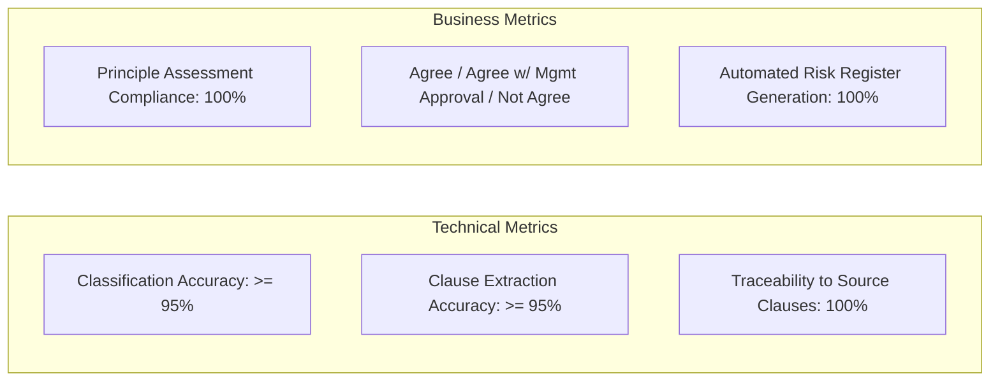
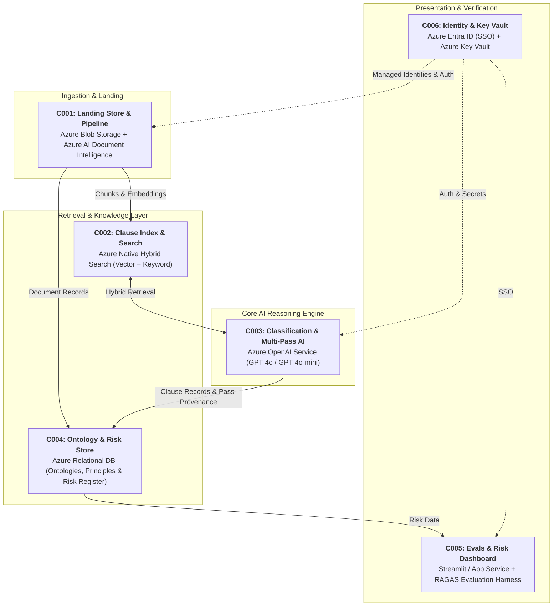
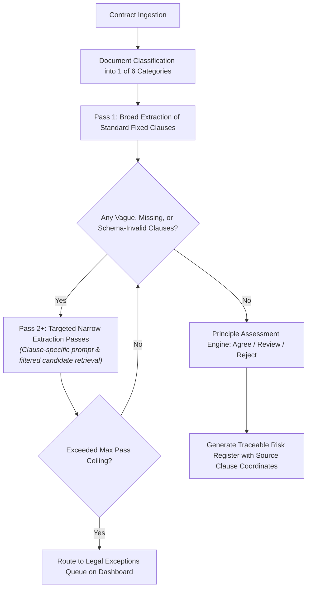
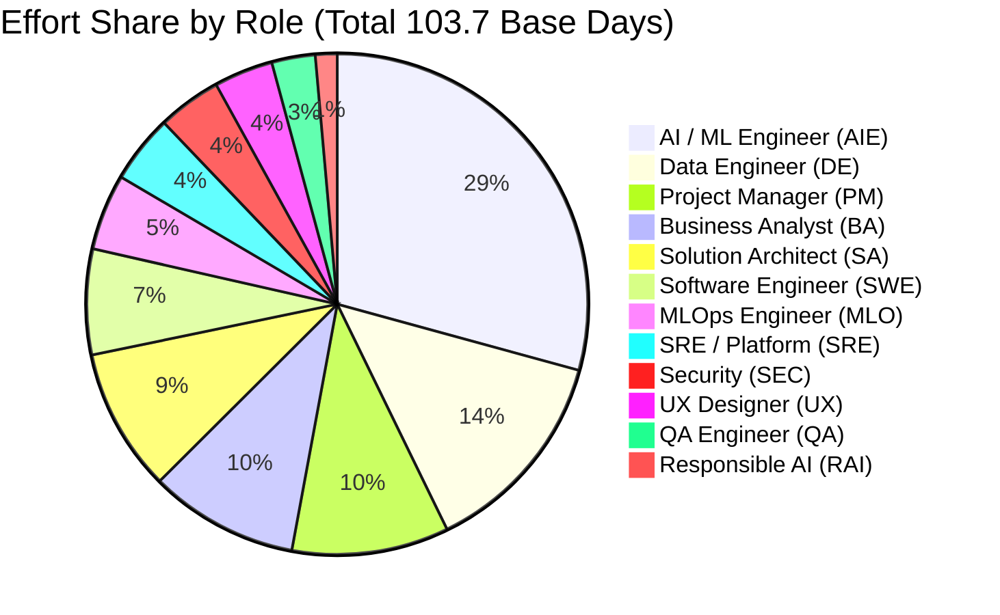

# 📑 Enterprise AI Business Requirements Document & Sizing Specification
## Project: Contract Intelligence & Risk Visibility Platform
### Client: PVR INOX | Delivery Tier: Proof of Concept (PoC) | Region: India (Azure)

---

## 1. Executive Summary & Engagement Profile

| Attribute | Specification |
| :--- | :--- |
| **Client / Account** | **PVR INOX** (Cinema Exhibition & Entertainment) |
| **Engagement Name** | Contract Intelligence & Risk Visibility Platform |
| **Solution Domain** | Artificial Intelligence / Generative AI |
| **Primary Cloud Platform** | Microsoft Azure (India Region - Central India / South India) |
| **Delivery Tier** | **Proof of Concept (PoC)** (Tier Multiplier: `0.289x`) |
| **Reference Duration** | **6.0 Weeks** (30 Working Days) |
| **Planned Start Date** | 28-Sep-2026 |
| **Total Estimated Effort** | **127.1 Person-Days** (1,143.9 Person-Hours @ 9 hrs/day) |
| **Peak Team Allocation** | **5.13 FTEs** |
| **Key Decision Gate Signatory**| Nithin Arora (Executive Sponsor) |
| **Operational Single Point of Contact** | Jitender Verma (SPOC) |

---

## 2. Business Problem Statement & Objectives

### 2.1 Current-State Challenges (As-Is)
PVR INOX executes and maintains thousands of commercial agreements across six critical business categories: **Lease, Vendor, Service, Facilities, Technology, and Marketing**.

- **Format Heterogeneity**: Contracts are maintained in variable formats, layouts, and typography across regional cinema properties.
- **Manual Bottlenecks**: Contract reviews require scarce legal and procurement subject matter experts (SMEs), creating multi-week turnaround times.
- **Inconsistent Standard Enforcement**: Different categories require adherence to distinct contracting principles; deviations from standard terms are frequently missed during routine operations.
- **Fragmented Risk Visibility**: Review findings, exceptions, and deviation approvals reside in disconnected spreadsheets and emails without an auditable traceability trail back to source clauses.

### 2.2 Project Objectives (To-Be)
Validate the technical, operational, and commercial viability of automated contract classification, clause extraction, principle assessment, and risk register generation using representative contract samples.

### 2.3 Success Metrics

---

## 3. Scope Definition

### 3.1 In-Scope (Phase 1: Proof of Concept)
- **Representative Corpus**: Ingestion of ~100 historical English digital contracts per category (**600 total contracts** across 6 categories).
- **Ontology & Principles**: Definition and configuration of contract ontologies and principle rule sets for all 6 categories.
- **Contract Classification**: Automated categorization across the 6 in-scope categories.
- **Multi-Pass Clause Extraction**: Broad extraction for standard clauses + targeted secondary passes for ambiguous/negotiated terms.
- **Principle Assessment Framework**: Evaluation producing `Agree`, `Agree with Management Approval`, or `Not Agree` with clause-level rationales.
- **Contract Risk Register**: Automated export in PVR INOX's existing review structure, enhanced with direct links to source clauses and page coordinates.
- **Demonstration Dashboard**: Read-only risk visualization portal integrated with corporate Single Sign-On (Entra ID).
- **Evaluation Harness**: Automated benchmarking against a legal-verified "golden dataset".

### 3.2 Explicitly Out-of-Scope (Deferred to Phase 2 / Production)
- **No Production System Integrations**: Zero direct API connectors to ERP or document stores; files are placed into Azure Blob Storage manually by PVR INOX.
- **No Scanned / Handwritten Documents**: Only digital, machine-readable PDFs are processed in this phase (optical recognition tuning is deferred to Phase 2).
- **No Unsigned Draft Contracts**: Review is performed strictly on executed historical agreements.
- **No Non-English Documents**: Limited strictly to English-language agreements.
- **No Automated Decision-Making**: The AI operates strictly as an assistant; all final legal risk acceptance remains with PVR INOX legal teams.
- **No High Availability / Disaster Recovery**: Single-instance non-production infrastructure (pause-and-resume model).

---

## 4. System Architecture & Technical Component Decomposition

The solution comprises **6 primary architecture components** deployed within an existing non-production Microsoft Azure subscription in India:

### Component Details

| CID | Component Name | Technology Stack | Key Responsibilities |
| :--- | :--- | :--- | :--- |
| **C001** | Landing Store & Ingestion Pipeline | Azure Blob Storage, Azure AI Document Intelligence | Ingests authoritative contract samples; recovers layout-aware text with exact page bounding-box coordinates for 100% auditability. |
| **C002** | Clause Index & Retrieval Layer | Azure AI Search (Hybrid Vector + Keyword) | Stores clause-level chunks (1,536-dimension embeddings) with document and coordinate metadata; provides narrow clause-specific filtering. |
| **C003** | Classification, Multi-Pass Extraction & Assessment Engine | Azure OpenAI Service | Classifies document category; runs multi-pass clause extraction; evaluates clauses against contracting principles. |
| **C004** | Ontology & Risk Register Store | Azure SQL / PostgreSQL (PaaS) | Persists ontologies, principle rules, extraction pass provenance, exceptions, and the master contract risk register. |
| **C005** | Evaluation Harness & Risk Dashboard | Azure App Service / Reporting | Scores extraction against the legal benchmark set; renders read-only risk exposure by category, deviations, and approval queues. |
| **C006** | Identity, Secrets & Landing Zone | Azure Entra ID, Azure Key Vault | Enforces corporate Single Sign-On (SSO) for named project users; manages managed identities and secrets across Dev, Test, and UAT. |

---

## 5. Multi-Pass Model & Extraction Strategy

> [!IMPORTANT]
> **Single-Pass Extraction Was Rejected**: A single-pass prompt over an entire contract produces high hallucination rates on complex, heavily negotiated, or vague clauses.

The engine implements a **Pass-Aware Orchestration Pipeline**:

---

## 6. Sizing Drivers & Scale Baseline

The solution capacity and infrastructure footprints are sized using deterministic formulas:

| Category | Metric | Baseline Value | Sizing Impact |
| :--- | :--- | :--- | :--- |
| **Users** | Total Named Users | **200** | Entitled users across legal & business |
| **Concurrency** | Peak Concurrent Users | **50** | Sizing baseline for live target state |
| **Transactions** | Requests per Day | **2,000 requests** | Ingestion & query transactions |
| **Throughput** | Peak Requests per Second | **3.0 req/sec** | Sizing driver for compute reservation |
| **Prompt Length** | Avg User Prompt Tokens | **500 tokens** | Excluding retrieved context |
| **Completion** | Avg Output Tokens | **2,000 tokens** | Structured JSON extraction payload |
| **Retrieval** | Retrieved Context per Request | **2,560 tokens** | 5 chunks $\times$ 512 tokens/chunk |
| **Corpus** | Total Live Corpus Target | **50,000 Documents** | Eventual production volume |
| **Vectors** | Searchable Index Vector Count | **2,000,000 vectors** | 50k docs $\times$ 40 chunks/doc |
| **Index Size** | Searchable Index Footprint | **23.76 GB** | 1,536-dim float32 vectors + metadata |
| **Compute** | Peak Application Footprint | **1.0 vCPU / 4.0 GB RAM** | 2 instances per environment |
| **Tokens (Monthly)**| Azure OpenAI Model Throughput | **238,040,000 tokens/mo** | Peak reservation: **973,800 tokens/min** |

---

## 7. Work Breakdown Structure (WBS) & Effort Sizing

### 7.1 Effort Rollup

$$\text{Total Effort} = \text{Base Delivery (97.5)} + \text{P18 PM Tasks (6.3)} + \text{PM Overhead 12\% (11.7)} + \text{Contingency 10\% (11.6)} = \mathbf{127.1\text{ Person-Days}}$$

### 7.2 Phase-by-Phase Effort Distribution (P01 – P18)

| Phase | Phase Description | Base Days | PoC Factor | Applied Effort (Days) | Key Deliverables |
| :--- | :--- | :---: | :---: | :---: | :--- |
| **P01** | Mobilisation & Discovery | 13.0 | `1.000` | **11.05** | RACI, discovery workshops, governance set-up |
| **P02** | Requirements & Use Cases | 22.0 | `0.400` | **7.48** | Functional specs, persona mapping, MoSCoW |
| **P03** | Data Discovery & Preparation | 27.0 | `0.300` | **6.88** | Data profiling, PII strategy, golden set |
| **P04** | Solution Architecture | 23.0 | `0.350` | **6.84** | Architecture blueprint, sizing & ADRs |
| **P05** | Landing Zone & Platform Setup | 20.0 | `0.250` | **4.25** | Resource groups, Key Vault, AI quotas |
| **P06** | Data Pipeline & Embedding | 33.0 | `0.400` | **11.22** | Document parsing, chunking & embeddings |
| **P07** | Retrieval & Index Build | 17.0 | `0.500` | **7.24** | Hybrid index, schema & relevance tuning |
| **P08** | Model Orchestration & Prompts | 35.0 | `0.550` | **16.32** | Multi-pass prompts, agent routing, schema validation |
| **P09** | Fine-Tuning & Model Adaptation | 16.0 | `0.200` | **2.72** | Evaluated as unneeded; feasibility check only |
| **P10** | Application & API Layer | 39.0 | `0.250` | **8.29** | Internal API, business rules, dashboard backend |
| **P11** | Evaluation & Golden Sets | 22.0 | `0.250` | **4.67** | RAGAS benchmark harness, SME review rounds |
| **P12** | Responsible AI & Safety | 31.0 | `0.100` | **2.63** | Content safety guardrails, threat modeling |
| **P13** | MLOps / IaC & CI-CD | 24.0 | `0.050` | **1.02** | Baseline environment scripts (manual promote) |
| **P14** | Observability & FinOps | 19.0 | `0.100` | **1.62** | Token telemetry & operating cost model |
| **P15** | Testing (Functional, UAT) | 33.0 | `0.150` | **4.19** | Test plan, UAT facilitation & defect triage |
| **P16** | Cutover & Hypercare | 18.0 | `0.050` | **0.77** | Smoke test, readiness review, best-effort support |
| **P17** | Documentation & Handover | 16.0 | `0.150` | **2.04** | Architecture docs, admin & curation guides |
| **P18** | Project Management & Governance | 21.0 | `0.350` | **6.25** | Weekly governance, RAID log, phase gates |
| **—** | **Total Delivery Effort** | **430.0** | — | **97.50** | *(Before PM uplift and contingency)* |

---

## 8. Team Roles & Resource Loading

### 8.1 Role Allocation & Effort Share

### 8.2 6-Week Resource Loading Schedule (FTE per Week)

| Role Code | Role Name | Total Days | Peak FTE | W1 | W2 | W3 | W4 | W5 | W6 | Feasibility |
| :--- | :--- | :---: | :---: | :---: | :---: | :---: | :---: | :---: | :---: | :---: |
| **PM** | Project Manager | 10.5 | 1.35 | 0.67 | 0.19 | — | — | — | 1.35 | `OK` |
| **BA** | Business Analyst | 10.0 | 0.91 | 0.91 | 0.44 | — | — | 0.33 | 0.41 | `OK` |
| **SA** | Solution Architect | 9.5 | 0.94 | 0.63 | 0.94 | 0.18 | — | — | 0.24 | `OK` |
| **AIE** | AI / ML Engineer | 30.3 | 2.45 | 0.08 | 0.34 | 1.40 | 2.45 | 2.09 | — | `OK` |
| **DE** | Data Engineer | 14.0 | 1.48 | 0.17 | 0.99 | 1.48 | 0.30 | — | — | `OK` |
| **MLO** | MLOps / LLMOps Engineer | 5.1 | 0.44 | — | 0.24 | 0.16 | 0.20 | 0.44 | 0.03 | `OK` |
| **SWE** | Full-Stack Software Engineer | 7.1 | 1.20 | — | — | — | 0.30 | 1.20 | — | `OK` |
| **UX** | UX / Interaction Designer | 3.8 | 0.33 | 0.33 | 0.33 | — | 0.03 | 0.11 | — | `OK` |
| **QA** | QA / Test Engineer | 2.9 | 0.46 | — | — | — | — | 0.15 | 0.46 | `OK` |
| **SEC** | Security Engineer | 4.3 | 0.50 | 0.04 | 0.50 | 0.11 | — | 0.25 | — | `OK` |
| **SRE** | SRE / Platform Engineer | 4.6 | 0.39 | — | 0.39 | 0.16 | — | 0.24 | 0.18 | `OK` |
| **RAI** | Responsible AI Lead | 1.5 | 0.32 | — | — | — | — | 0.32 | — | `OK` |
| **TOTAL** | **Team Headcount Loading** | **103.7** | **5.13** | **2.83** | **4.36** | **3.49** | **3.28** | **5.13** | **2.67** | **PASS (0 Stretch)** |

---

## 9. Bill of Materials (BoM) & Infrastructure Sizing

All infrastructure components map to Microsoft Azure services in the India region:

| BID | Category | Component | Azure Offering / SKU Specification | Monthly Volume |
| :--- | :--- | :--- | :--- | :--- |
| **B001** | AI Model | Azure OpenAI (Generative) | Generative Model Deployment (GPT-4o / GPT-4o-mini) | 238,040,000 tokens/mo |
| **B002** | AI Model | Azure OpenAI (Embeddings) | Text-Embedding-3-Small (1,536 dimensions) | 150,040,000 tokens/mo |
| **B003** | AI Service | Document Intelligence | Azure AI Document Intelligence (Layout Model) | 2,000 requests/day |
| **B004** | Search | Vector Index | Azure AI Search (Hybrid Vector + Keyword Index) | 23.76 GB searchable index |
| **B005** | Storage | Contract Landing Store | Azure Blob Storage (Hot Tier, LRS) | 1.0 GB raw sample |
| **B006** | Database | Ontology & Risk Store | Azure SQL Database / Flexible PostgreSQL | 32.26 GB persistent store |
| **B007** | Storage | Processed Corpus Cache | Azure Blob Storage (Intermediate per-pass outputs) | 1.40 GB processed cache |
| **B008** | Compute | Ingestion & Orchestration | Azure Container Apps / Functions (Batch processing) | 4.0 instances across envs |
| **B009** | Compute | Dashboard & API Hosting | Azure App Service (Basic / Standard Linux tier) | 2.0 instances |
| **B013** | Identity | Corporate SSO | Microsoft Entra ID (Existing PVR INOX tenant) | Named project user seats |
| **B014** | Security | Secrets Management | Azure Key Vault (Standard tier) | Project secrets & keys |
| **B016** | Telemetry | Logging & Tracing | Azure Monitor / Application Insights | 6.34 GB log retention |

---

## 10. Gated Governance Assumptions & Prerequisites

The engagement is governed by **83 formally approved assumptions and prerequisites**, including:
1. **P001 (Residency Sign-Off)**: PVR INOX Legal signs off that India-region Azure hosting complies with data residency before contract upload.
2. **P004 (Corpus Release)**: PVR INOX supplies 100 contracts per category (covering standard, negotiated, and known-deviation scenarios) into Blob storage.
3. **P006 (Benchmark Answer Key)**: PVR INOX Legal provides an agreed benchmark set of manually reviewed contracts to serve as the ground truth.
4. **P007 (Clause Freeze)**: The clause attribute list per category is finalized in Workshop 1 and frozen to prevent scope creep.
5. **A014 (Human Oversight)**: The solution is an assistant; 100% of findings require human review before legal action.
6. **A041 (Sponsor Signatory)**: Nithin Arora is confirmed as the single signatory for decision-gate sign-off.
7. **P025 (Azure Quota)**: Azure OpenAI token and request quotas in the non-production subscription must have sufficient headroom for multi-pass evaluation runs before kickoff.
